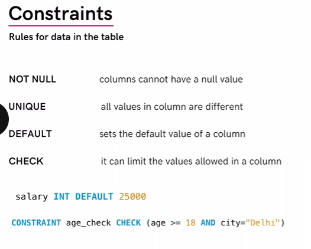

//1. What is DataBase 

our DataBase will be MySQL and Language will be SQL

we use SQL to access the database and make changes in the database
dev-> SQL(Language)->Database

What is a Database?
It is a collection of data in a format that can be easily accessed.

Why databases?
•can store large data
•features like security, scalability etc.
•Easier to insert, update or delete data

DBMS->DataBase Management system
DBMS jo hai wo ek covering type hai on Database for using functions on it

//2. SQL vs NoSQL

SQL
Relational Database (data stored in Tables)
eg - MySQL, Oracle, PostgreSQL etc.

NoSQL
Non Relational Database (data stored in document/key-vallgraphs etc.)
eg - MongoDb, Cassandra,Ne04j etc.

//3. What is SQL
SQL (Structured Query Language)
SQL is a programming language used to interact with relational databases.

here in the college  Database we have multiple table such as student and Teacher
in this table we store our data

similarly for a company it will have seperate database with it own tables of employee and data

So in a database we have multiple table which are related

//4. What are Table in SQL

we have a user table below

there are separate columns, this column tell us about design or schema of table

In each row we have data of 1 user

rows are also called record or tuple

//using SQL

//we need
//1.MySql server to create DB tables
//2. to access sql we use MySQL workBench

//7.  Our 1st DataBase
CREATE DATABASE db_name;
DROP DATABASE db_ name;
USE db_ name;

//8. Our 1st Table
TABLE table_name (
CREATE
column_ namel datatype constraint,
column _ name2 datatype constraint,
column_ name2 datatype constraint
);

//9. DataBase Queries

CREATE DATABASE db_name;   //if database already exist we get error
CREATE DATABASE IF NOT EXISTS db_name; if database already exist we get a warning only

DROP DATABASE db_name;
DROP DATABASE IF EXISTS db_name;

SHOW DATABASES;
SHOW TABLES;

//10. Table Queries
•Create  to create a new table 
•Insert  to add data/tuples/records in table
•Update   to update data
•Alter      to alter the schema of the table
•Truncate   to delete all the data inside a table and make it empty
•Delete    to delete complete table

1. Create Table : to define schema or columns of table
   CREATE TABLE table-name (
   column_name1 datatype constraint,
   column_name2 datatype constraint,
   );

creating a user table for instagram database

//11. what are constraints?

//12. Key Constraint

we alpo can make combination multiple column as primaryKey

Foreign key in our table is a column which is a primary key in another table

ER Diagram 

//13. Primary and Foreign Key

What are Keys?
Keys are special columns in the table

Primary Key
It is a column (or set of columns) in a table that uniquely identifies each row. (a unique id)
There is only 1 PK & it should be NOT null.

Foreign Key
A foreign key is a column (or set of columns) in a table that refers to the primary key in another table.

FKs can have duplicate & null values.
There can be multiple FKs.

//14. INSERT INTO table

Table Queries

Insert into Table

INSERT INTO table_name
(colnamel, colname2);

VALUES
(col1_v1, col2_v2),
(col1_v1, col2_v2);

//15. SELECT command

Selects & Show data from the DB

Syntax :   SELECT col1, col2 FROM table_name;

Syntax (to show all): 

SELECT * FROM table_name;

