//1. WHERE clause: To define some conditions

SELECT col1, col2 FROM table_name
WHERE conditions;

//2.Operators

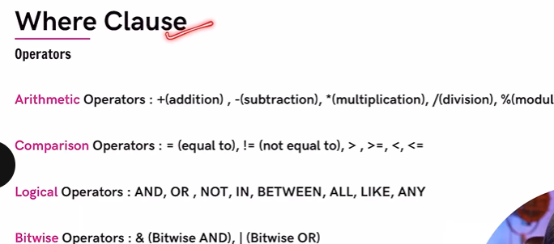

//3. frequently used Operators

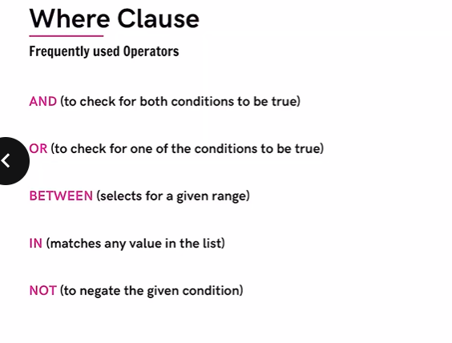

//4. LIMIT clause
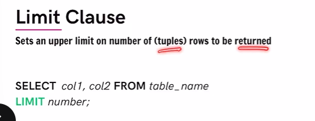

//5. ORDER BY Clause

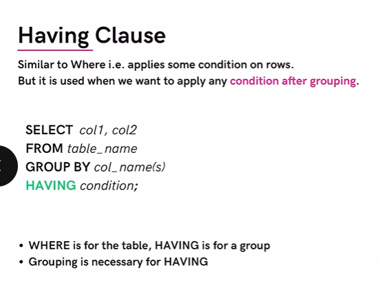

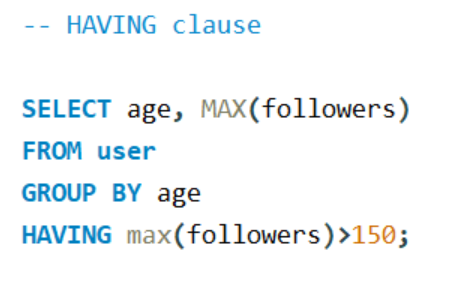

//9. General Order

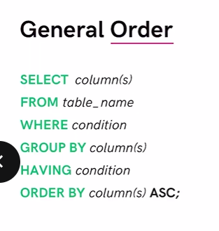

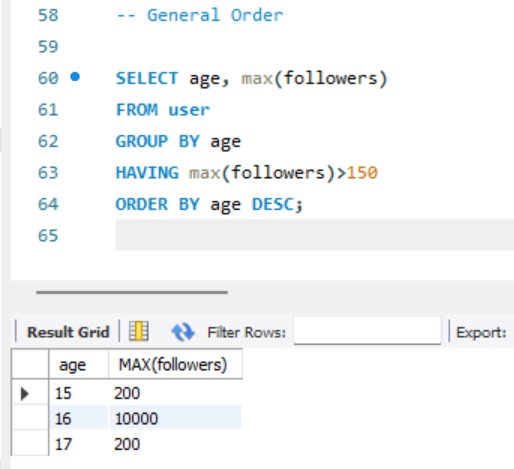

//10. UPDATE table

before updating run the following command :

SET SQL_SAFE_UPDATES = 0;

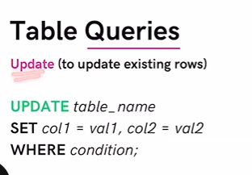

//11. DELETE Tables

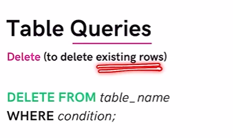

if we dont write the WHERE Condition it will delete all data from table

//12. ALTER Queries

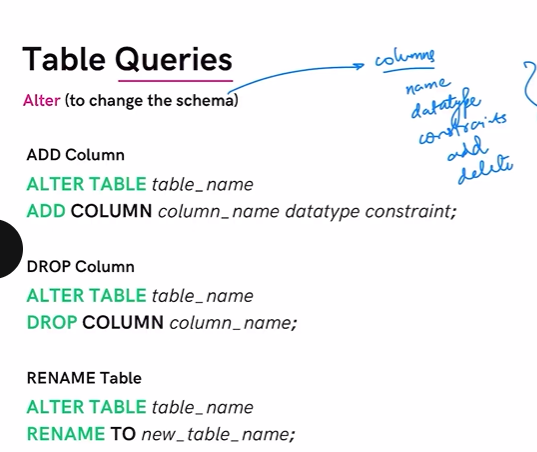

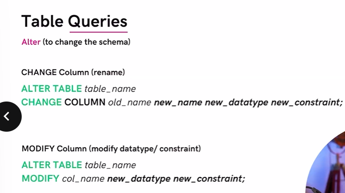

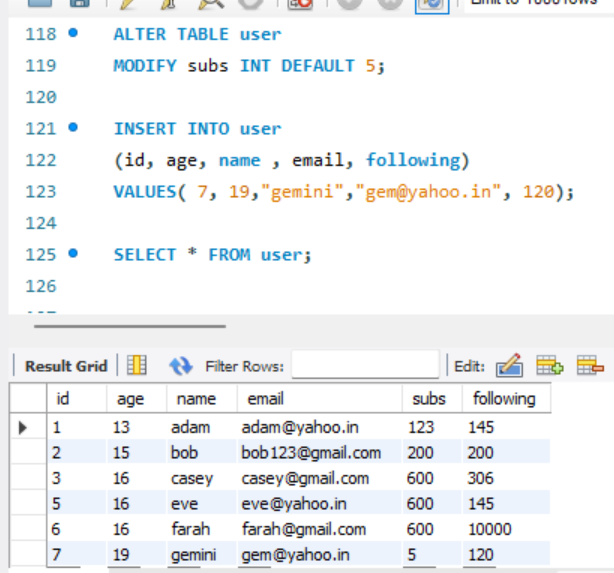

//13. TRUNCATE Table

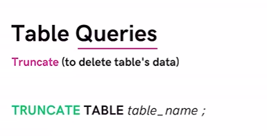

//14. Practise Qs 1

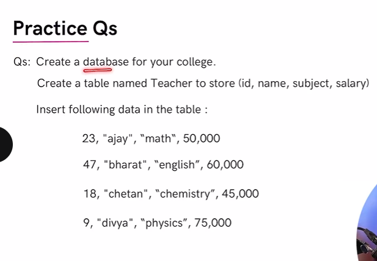

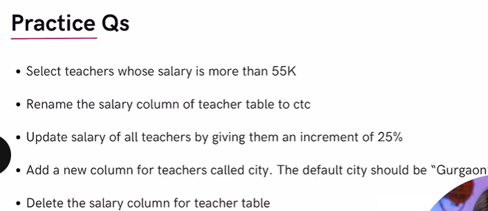

//15. Practise Q2

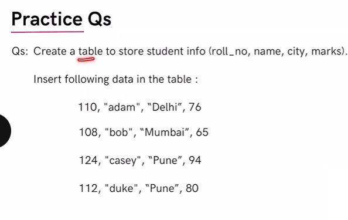

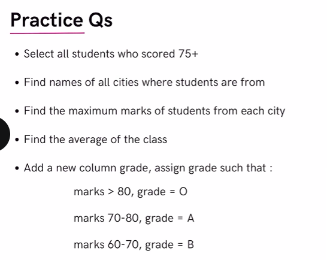