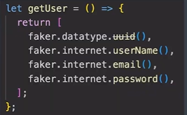
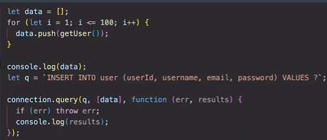
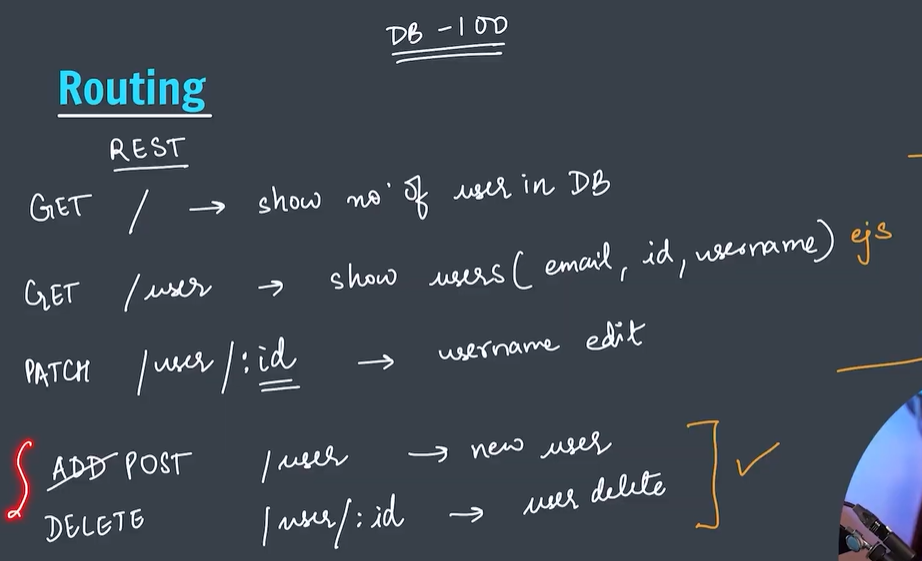

1. Faker Package
   To generate fake data

        userld   username    email   password

      

2.  MySQL2 Package

    To connect Node with MySQL
    connection.end(); // to close connection

3. Using SQL from CLI

          cd "C:\Program Files\MySQL\MySQL Server 8.0\bin"
          .\mysql -u root -p

            OR
            
            & "C:\Program Files\MySQL\MySQL Server 8.0\bin\mysql" -u root -p
    
            To check current directory in sql cli -> system cd

   Create schema.sql

    USE database_name
    source schema.sql //in CLI

4. CREATE Table user

        CREATE TABLE user (
            id VARCHAR(5Ø) PRIMARY KEY,
            username VARCHAR(5Ø) UNIQUE,
            email VARCHAR(5Ø) UNIQUE NOT NULL,
            password VARCHAR(5Ø) NOT NULL
        );
5. INSERT User
   using placeholders

6. INSERTING in Bulk
   using faker

7. Routing

8. ,9. Setting Up Express App
   install express and uuid

   GET/ Fetch and show total no. of users on our app
   
10. Creating our routes
  GET/ user  Fetch and show id,username,email of all user

11. Edit Routes
     Creating Our Routes
    
         GET /user/:id/edit         
     To get form to edit the username, based on id. This form will require a password

         PATCH /user/:id
     To edit username, if correct password was entered in form

12. Creating our route (updating DB)

