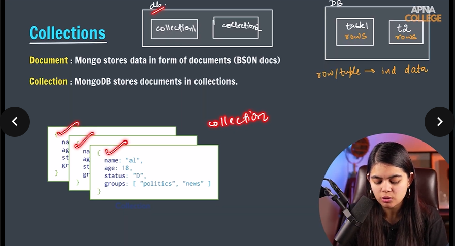
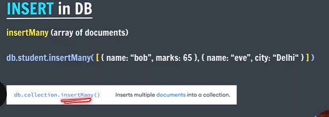
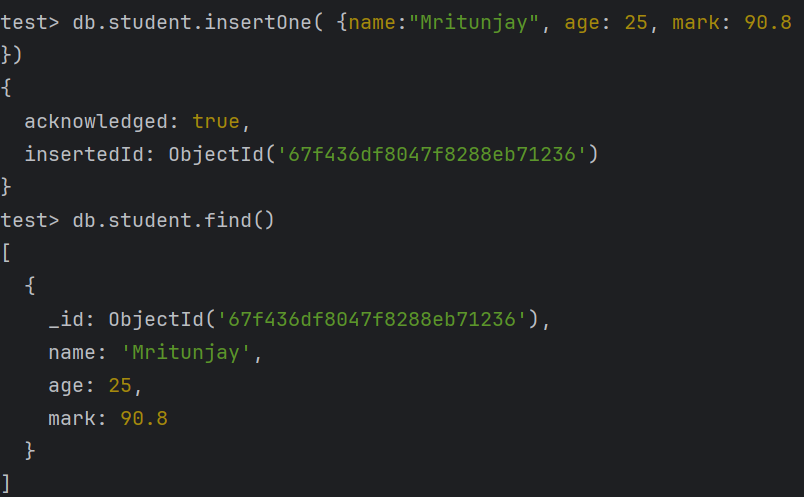
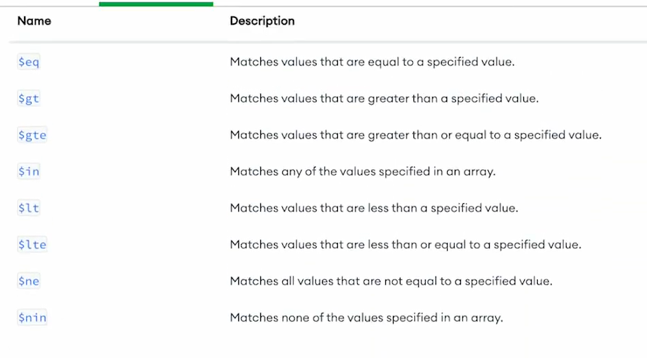
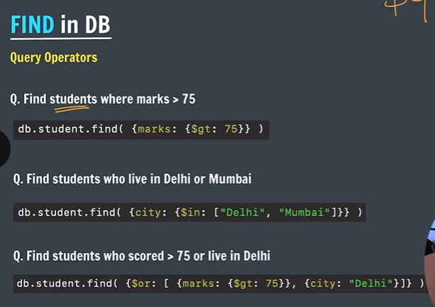
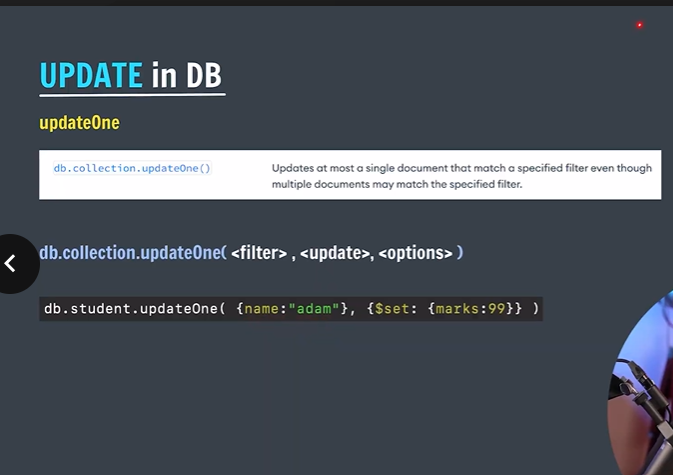
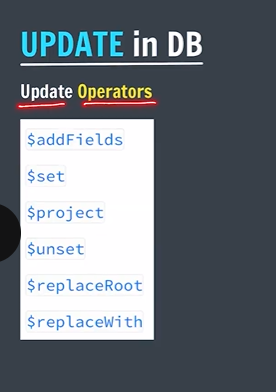
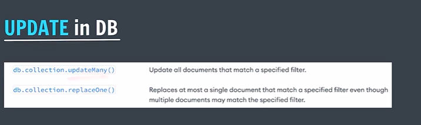
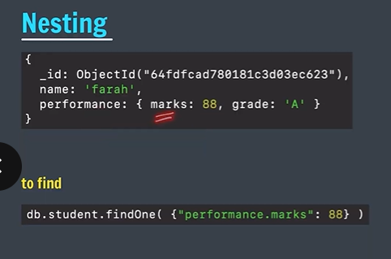

1. The Shell 

     mongosh   //to start the mongo in cmd

       use college  // to create and use a new database called college 

TO Perform CRUD operation(Create,Read,Update,Delete)

//to show all databases: show dbs
// to know current database: db

2. BSON Data
In Mongo DB data is stored in BSON format
   Binary JSON
 JSON have some issues: 
   it is text based format eg: {key: value} is in string
   space inefficient

 BSON advantage: convert json into binary and then stores in memory
 it has more datatypes support than json
 

3. Collections
Document : Mongo stores data in form of documents (BSON docs)
Collection : MongoDB stores documents in collections.

4. INSERT in DBa(Insert one)

5. INSERT in DB(insert many)

6. FIND in DB

db.collection.find( ) //returns everything

for specific queries

db.collection.find( { key: value } )  //prints document as it return cursor which is a reference to original
db.collection.findOne( { key: value }  )  //prints array of document i.e it prints the actual document

to find a specific document with multiple condition
db.collection.find({key1:value1, key2:value2})

7. Query Operator
   
   
   

8. Update in Database

9. Nesting

10. DELETE in DB

delete0ne            
db.collection.deleteOne( <filter> , <options> )

deleteMany
db.collection.deleteMany( <filter> , <options> )

db.dropDatabase( )