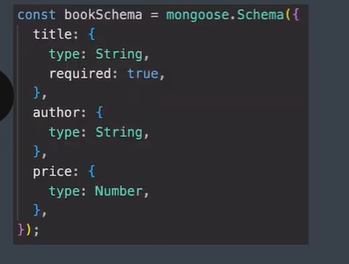

1. What is mongoose?
   Mongoose
   A library that creates a connection between MongoDB & Node.js JavaScript Runtime
   Environment
   It is an ODM (Object Data Modeling) Library in npm.
2. 
2. Install mongoose
         `npm init -y
          npm i mongoose`
3. Schema
Schema defines the shape of the document within that collection.

The Schema Type are
String
Number
Date
Buffer
Boolean
Mixed
Objectid
Array
Decimal128
Map
UUID

4. Models
Model in mongoose is a class with which we construct documents

5. INSERT 
Inserting One

6. Inserting Many

7. FIND
   Model.find() //returns a Query Object (thennable)
   *Mongoose Queries are not promises. But they have a .then( )

8. Update 

UpdateOne only updates the first document from all filtered document where as UpdateMany updates them all

9. Find And Update
Model.finsOneAndUpdate()

Model.finsByIdAndUpdate()

10. DELETE
Model.deleteOne() //return Count

to see what is being deleted

11. Schema Validations
Basically constraints or Rules for Schema like in sql

lets make a data base name amazon for amazon

required in mongo == NOT NULL in SQL