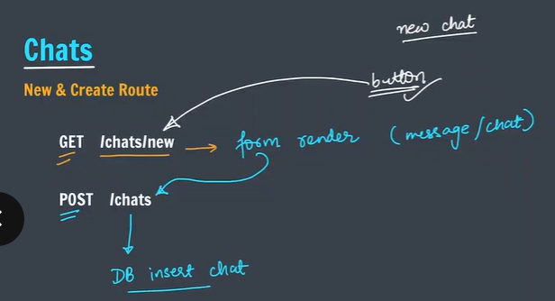
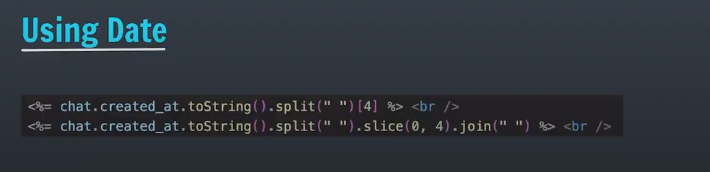

1. Basic set Up
Here we are going to use MongoDB as database with Express App

2. Creating the model

website jaha chats dikhai dengi

Chat will have : ( _id, from, to message, created_at);

routes:
 /chats
 update
 delete chats

3. Initialise database
 made init.js with dummy document to upload to collection and work on them

4. Chats

Index Route

GET Request accept karne ke liye "/chats" route banate hai
-->SHows all chats

5. Chats-II

New & Create Route

GET /chats/new
POST /chats

6.Using Date

7. Edit & Update Route

GET /chats/:id/edit

PUT /chats/:id

//8. Destroy Route
DELETE /chats/:id => delete chat with id